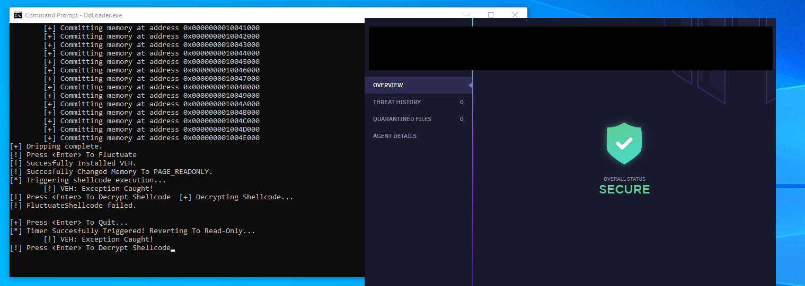
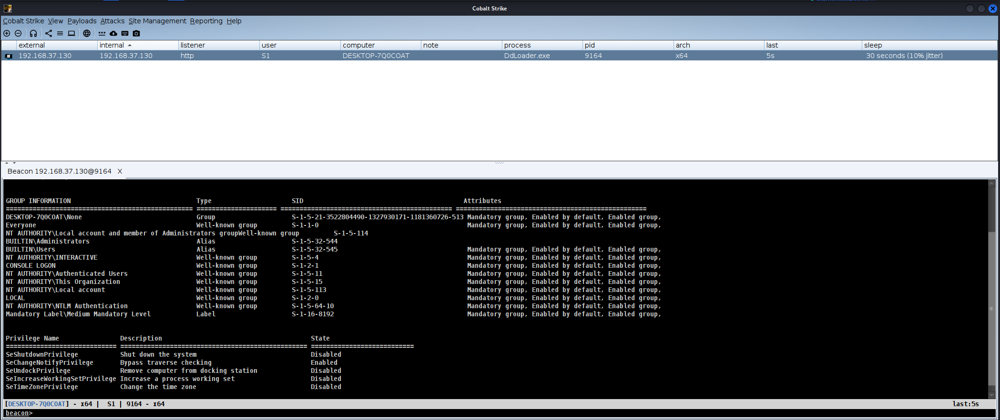

# DdLoader

Evasive shellcode loader which provides a means to bypass EDR solutions.

## Features
- Uses a Vectored Exception Handler (VEH) to decrypt shellcode at runtime and fluctuate memory protections between `RW` and `RX` using `CreateTimerQueueTimer` for evading memory scanners.
- Loads shellcode gradually in 4KB chunks to bypass event-based detection mechanisms.
- CRT Independent (no C runtime dependency).

## Demo  
Bypassing a commercially graded EDR with DdLoader using a custom Malleable C2 profile, UDRL, Sleepmask, and Artifact Kit:  

## References
- [ShellcodeFluctuation by mgeeky](https://github.com/mgeeky/ShellcodeFluctuation)
- [DripLoader by xuanxuan0](https://github.com/xuanxuan0/DripLoader)
